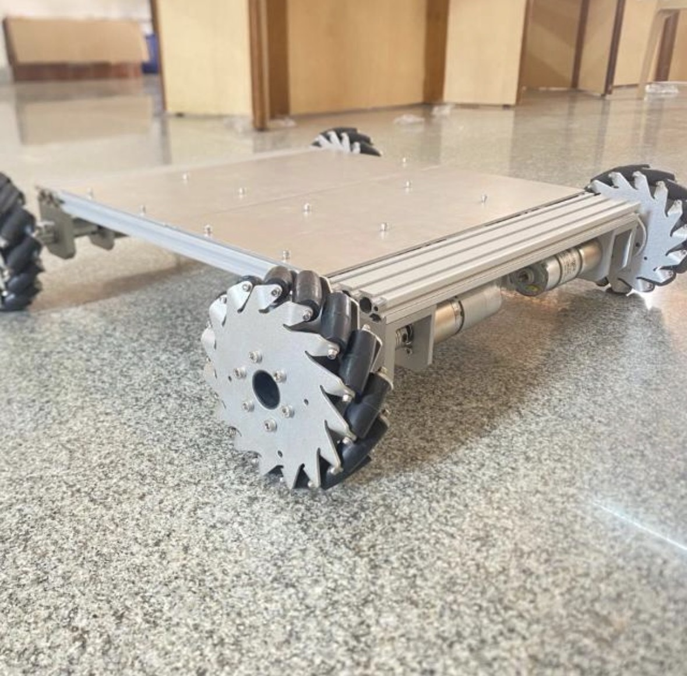
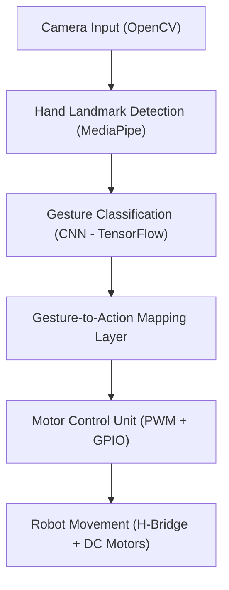
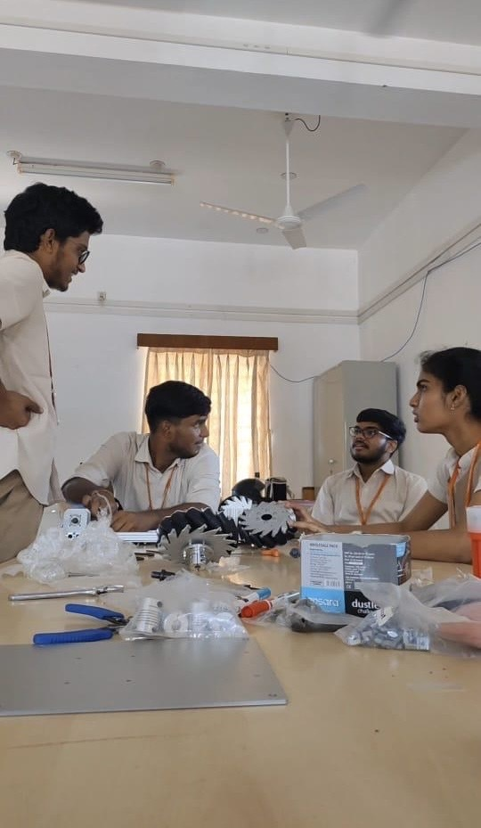

# 🤖 Vision-Based Gesture-Controlled Robot using Deep Learning

An end-to-end robotic control system built from scratch — integrating computer vision, deep learning, and motor control for real-time gesture-driven navigation.

----
### 🧠 Overview

This project implements a gesture-controlled mobile robot using computer vision (OpenCV + MediaPipe) and deep neural gesture recognition models (TensorFlow/Keras).
The robot interprets human hand gestures in real time to perform navigation tasks like move forward, reverse, turn left/right, and stop, leveraging a Raspberry Pi for onboard computation and motor control via an H-Bridge driver.

  

🛠️ **Built entirely from scratch** — from mechanical assembly and hardware wiring to computer vision pipeline and control logic — as part of a Reinforcement Learning & Robotics course capstone.

----
### 🎯 Key Features

| Feature                           | Description                                                                                                 |
| --------------------------------- | ----------------------------------------------------------------------------------------------------------- |
| **Real-time Gesture Recognition** | Detects hand landmarks using MediaPipe and classifies gestures using a deep CNN trained on custom datasets. |
| **Robotic Motor Control**         | Commands dual DC motors using PWM signals through an H-Bridge interface on a Raspberry Pi.                  |
| **Vision-Based Command Mapping**  | Gesture → Action mapping enables autonomous motion based purely on visual inputs.                           |
| **End-to-End Integration**        | Combines computer vision, deep learning, embedded control, and robotic hardware.                            |
| **Built-from-Scratch Robot**      | Complete mechanical build, wiring, and code integration designed by the team.                               |

----

## 🧩 System Architecture

----

### ⚙️ Technical Stack

| Domain                    | Technologies                                                                                  |
| ------------------------- | --------------------------------------------------------------------------------------------- |
| **Computer Vision**       | OpenCV, MediaPipe, Contour Analysis, Background Subtraction                                   |
| **Deep Learning**         | TensorFlow, Keras (CNN Gesture Classifier)                                                    |
| **Embedded Systems**      | Raspberry Pi 4, MDD10A H-Bridge Motor Driver                                                  |
| **Programming Languages** | Python                                                                                        |
| **Hardware Control**      | RPi.GPIO for PWM and direction control                                                        |
| **Dataset**               | Custom hand gesture dataset (`ok`, `stop`, `thumbs up`, `peace`, etc.) collected for training |

----

### 🚀 Project Pipeline

1️⃣ Data Acquisition

   - Collected gesture videos under varying lighting and background conditions.

   -  Labeled gesture frames for supervised model training.

2️⃣ Model Training

   - Built and trained a Convolutional Neural Network (CNN) using TensorFlow for gesture classification.

   - Applied transfer learning to improve generalization on a limited custom dataset.

3️⃣ Computer Vision Processing

   - Utilized MediaPipe Hands for 21-point landmark extraction from live video feed.

   - Integrated OpenCV for preprocessing, contour detection, and segmentation to improve robustness.

4️⃣ Gesture → Action Mapping

  | Gesture        | Action        |
  | -------------- | ------------- |
  | ✋ Stop         | Halt motors   |
  | 👍 Thumbs Up   | Move Forward  |
  | 👎 Thumbs Down | Move Backward |
  | 🤟 Rock        | Turn Right    |
  | ✌️ Peace       | Turn Left     |

5️⃣ Motor Control

   - Controlled dual DC motors through PWM signals via an MDD10A H-Bridge driver connected to the Raspberry Pi’s GPIO pins.

   - Implemented smooth acceleration/deceleration and safe shutdown routines to protect hardware during operation.

----
### 📸 Real Robot Build

🧩 Fully built and tested — below are snapshots from our final build and live testing sessions.

🎥 [You can watch the video here](https://drive.google.com/file/d/1VRiRxztKW1HbA51uEGdjKxSKgo_ikSBu/view?usp=sharing)

- ✅ Physical robot assembled using custom chassis, motor mount, and onboard camera.

  

  

- ✅ Controlled entirely via visual input — no manual remote or wired control.
  
----

### 🧪 Experimental Results

| Gesture      | Model Accuracy | Latency (ms) | Action       |
| ------------ | -------------- | ------------ | ------------ |
| 👍 Thumbs Up | 98.2%          | 43           | Move Forward |
| ✋ Stop       | 99.1%          | 39           | Halt         |
| ✌️ Peace     | 97.3%          | 41           | Turn Left    |
| 🤟 Rock      | 96.7%          | 45           | Turn Right   |

Overall System FPS: ~20 FPS on Raspberry Pi 4
Inference Latency: <50ms (real-time gesture recognition)

----
### 🧰 Hardware Used

| Component                         | Purpose                                     |
| --------------------------------- | ------------------------------------------- |
| **Raspberry Pi 4 (4GB)**          | Primary compute unit for vision and control |
| **Pi Camera Module**              | Real-time image capture                     |
| **MDD10A Dual Motor Driver**      | PWM-based control of DC motors              |
| **DC Motors x2**                  | Left and right wheel drive                  |
| **Custom Chassis + Battery Pack** | Robot structure and power supply            |

---

### 🪄 Example Demonstration

🎥 [Watch the full demo video here](https://drive.google.com/file/d/1gDslwxUc42q6Ab_ui_Cp4RA9wO_7yLVr/view?usp=sharing)

